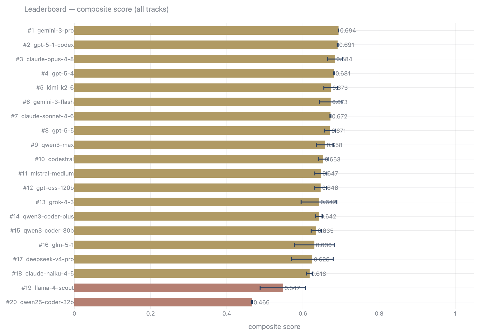
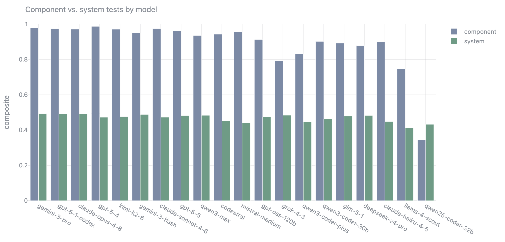
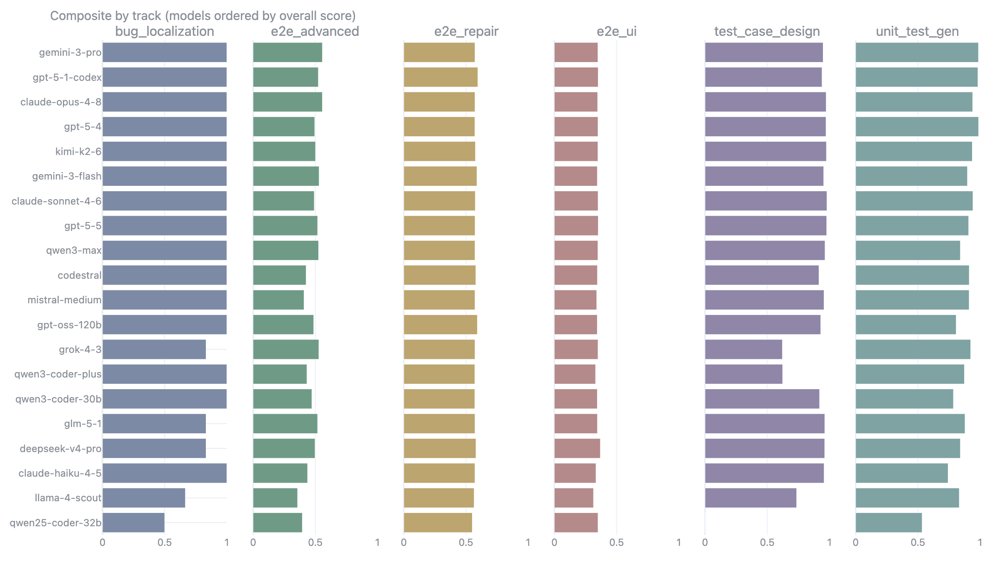
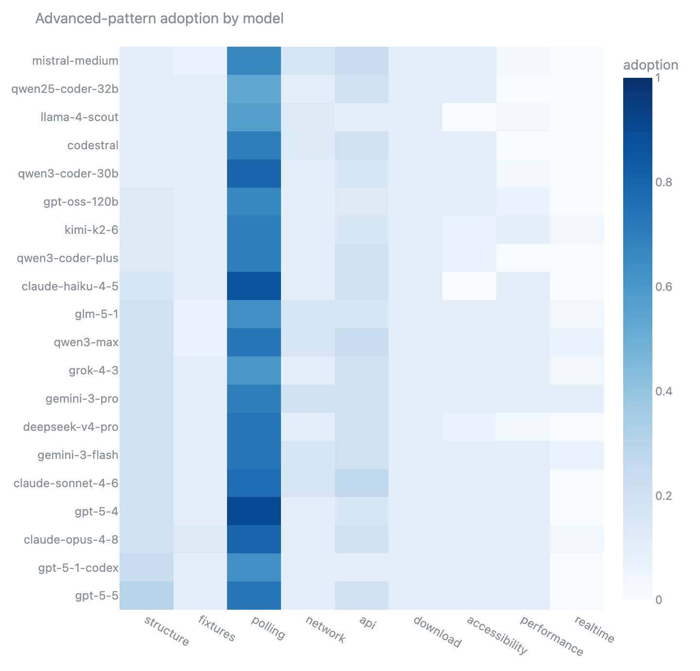
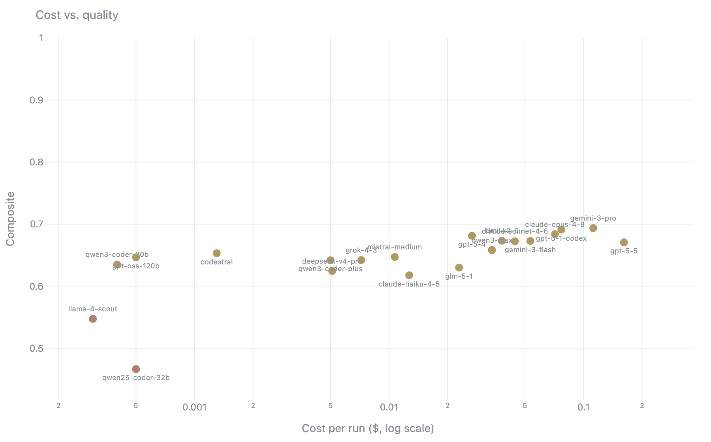
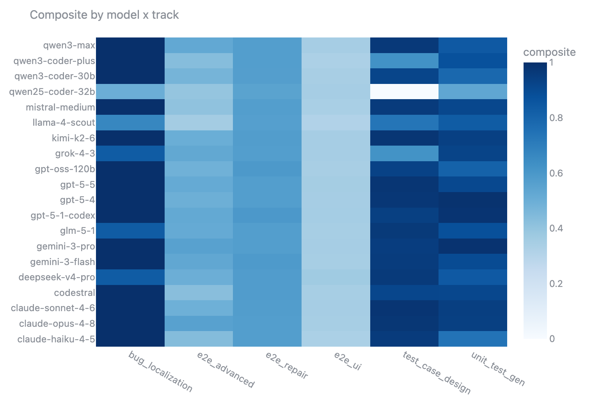

# llm-qa-benchmark

An execution-based benchmark that evaluates LLMs on QA and test-automation tasks. It runs what each
model produces, including generated test suites, bug fixes, and UI scripts, rather than judging text
alone.

## Results

Twenty models, three trials per item. `Composite` is the equal-weight mean of the five
execution-grounded tracks (the judge-only `test_case_design` track is reported separately);
`E2E adv.` is the composite on the advanced-patterns track; `$/correct` is the cost per passing
sample.

| # | Model | Composite | Tier | E2E adv. | $/run | $/correct |
|---|-------|-----------|------|----------|-------|-----------|
| 1 | Gemini 3.1 Pro | 0.694 | B | 0.56 | $0.1122 | $0.1372 |
| 2 | GPT-5.1 Codex | 0.691 | B | 0.52 | $0.0769 | $0.0940 |
| 3 | Claude Opus 4.8 | 0.684 | B | 0.56 | $0.0713 | $0.0923 |
| 4 | GPT-5.4 | 0.681 | B | 0.50 | $0.0267 | $0.0326 |
| 5 | Kimi K2.6 | 0.673 | B | 0.50 | $0.0380 | $0.0492 |
| 6 | Gemini 3.5 Flash | 0.673 | B | 0.53 | $0.0533 | $0.0733 |
| 7 | Claude Sonnet 4.6 | 0.672 | B | 0.49 | $0.0444 | $0.0543 |
| 8 | GPT-5.5 | 0.671 | B | 0.52 | $0.1614 | $0.2219 |
| 9 | Qwen3.7 Max | 0.658 | B | 0.53 | $0.0338 | $0.0496 |
| 10 | Codestral 2508 | 0.653 | B | 0.43 | $0.0013 | $0.0016 |
| 11 | Mistral Medium 3.5 | 0.647 | B | 0.41 | $0.0107 | $0.0138 |
| 12 | GPT-OSS 120B | 0.646 | B | 0.49 | $0.0005 | $0.0007 |
| 13 | Grok 4.3 | 0.642 | B | 0.53 | $0.0072 | $0.0113 |
| 14 | Qwen3 Coder Plus | 0.642 | B | 0.43 | $0.0050 | $0.0079 |
| 15 | Qwen3 Coder 30B | 0.635 | B | 0.47 | $0.0004 | **$0.0006** |
| 16 | GLM 5.1 | 0.630 | B | 0.52 | $0.0229 | $0.0336 |
| 17 | DeepSeek V4 Pro | 0.625 | B | 0.50 | $0.0051 | $0.0080 |
| 18 | Claude Haiku 4.5 | 0.618 | B | 0.44 | $0.0127 | $0.0214 |
| 19 | Llama 4 Scout | 0.547 | C | 0.36 | $0.0003 | **$0.0006** |
| 20 | Qwen2.5 Coder 32B | 0.466 | C | 0.40 | $0.0005 | $0.0039 |

The advanced-patterns track is the separator: models cluster near the ceiling on the component
tracks, but `E2E adv.` scores range from 0.36 to 0.56, exposing which models recognize that a
scenario calls for reusable structure, fixtures, polling, network interception, direct API testing,
file-download handling, an accessibility audit, a performance budget, or realtime/WebSocket
interception without being told. The new repair track is the opposite — handed a failing test and
its Playwright error, every model fixes it to roughly the same degree (~0.57), so giving the model
the failure output makes the task tractable across the board. Averaging the execution tracks equally
pulls the field into a single B tier and widens the spread. The open-weight coders remain the value
story: **GPT-OSS 120B** and **Qwen3 Coder 30B** stay competitive for a fraction of a cent per
correct sample.



Tracks split into two tiers: **component** (unit/spec-level) and **system** (browser/integration).
Every model is near the ceiling on the component tracks; the system tracks open a wide gap.





The `e2e_advanced` track measures whether a model reaches for the technique a scenario implies. Most
recognize API and network-interception needs, but few use page objects, fixtures, or explicit
polling even when warranted.







The interactive dashboard, launched with `uv run qabench dashboard`, presents each model's most
recent result as a single cross-model comparison with system-aware light and dark themes.

## What It Measures

Five tracks, each scored by what the model actually produces.

| Track | Task | Scored by |
|-------|------|-----------|
| **`unit_test_gen`** | Write a unit-test suite for a module | Execution: validity, mutation-kill rate, coverage |
| **`bug_localization`** | Find the buggy line and propose a fix | Line accuracy and repair execution against a hidden test |
| **`test_case_design`** | Design black-box test cases from a spec | LLM judge against an equivalence and boundary rubric |
| **`e2e_ui`** | Write a Playwright script for a user flow | Execution against a sample app and selector robustness |
| **`e2e_advanced`** | Write a Playwright test for a richer scenario | Execution plus detection of the implicitly-required technique |
| **`e2e_repair`** | Fix a failing Playwright test from its runner output | Execution: the corrected test must pass (and preserve existing structure) |

The `e2e_advanced` track presents scenarios that call for reusable structure (any of page object
model, page-object-component, screenplay, or helper decomposition), fixtures, polling, network
interception, direct API testing, file-download handling, an accessibility audit, a performance
budget, or realtime/WebSocket interception, without naming the technique. No single structural
pattern is mandated or disallowed. A model is scored on whether it recognizes and applies an apt
tool. It runs against a dedicated app in `docker/advanced-app`. Mobile automation (Appium) is out of
scope for now: the web-execution sandbox cannot run a device emulator, and scoring it by detection
alone would break the execution-based principle.

The `e2e_repair` track gives the model a failing test plus the Playwright runner output (the
artifact an engineer pastes into an assistant) and scores whether the returned fix actually passes
when run. One sample's broken test already uses a page object, so the fix is also checked for
preserving that structure rather than flattening it.

The benchmark is primarily execution-based; LLM judges supplement it with design-quality and
hallucination signals. The headline `Composite` is the equal-weight mean of the four
execution-grounded tracks' composites, so each track counts once regardless of its sample count.
`test_case_design` is scored entirely by an LLM judge, so it is reported on its own and excluded
from the headline composite.

## Quickstart

```bash
uv sync --extra dev --extra dashboard
cp .env.example .env                                  # add OPENROUTER_API_KEY

uv run qabench list-models
uv run qabench show-prompt --track all
uv run qabench run --track unit_test_gen --models claude-sonnet-4-6 --limit 5
uv run qabench score <run_id>
uv run qabench dashboard
```

A single `OPENROUTER_API_KEY` is required. It provides access to every benchmarked model and backs
the LLM judges. A local OpenAI-compatible server such as Ollama or vLLM is optional and used only by
the `local` provider.

The LLM judges can optionally be re-run at half price through the Anthropic Message Batches API:
`qabench rejudge <run_id>` keeps the execution and static columns and refreshes only the judge
columns. It needs the `judge` extra (`uv sync --extra judge`) and an `ANTHROPIC_API_KEY`; generation
still runs on OpenRouter.

## Evaluation Flow

Each model output is graded by what it does, not how it reads. For every sample:

1. **Execution.** The output runs in a sandbox to produce objective metrics: suite validity,
   mutation-kill rate, and coverage for `unit_test_gen`; fault-line accuracy and repair execution
   for `bug_localization`; pass or fail (and, for repair, whether the fix now passes) for the E2E
   tracks.
2. **Deterministic craft checks.** Static, no-API signals on the E2E tracks: locator strategy
   (role/label/test-id over brittle CSS and XPath), web-first vs. manual assertions, real waiting
   vs. fixed timeouts, hardcoded URLs, DOM-reaching code smells, and graded adoption of the
   technique the scenario implies. These were validated against a human-labelled golden set
   (`golden/`) before counting toward any score.
3. **LLM judges.** A hallucination judge flags references to functions or APIs absent from the code
   under test; a rubric judge scores design on the component tracks; and a structured review judge
   gives an opinionated craft read on the E2E tracks. The review judge agreed only weakly with human
   labels on the golden set, so it enters the composite at a low weight and never overrides
   execution.

These combine into a per-track composite score and an A/B/C tier. The overall composite averages the
execution-grounded tracks equally; the judge-only `test_case_design` track is reported separately and
excluded from it.

## Adding Models

Models live in [`config/models.toml`](config/models.toml). Adding one is a single `[[model]]`
entry, with no code changes; only `provider` affects behaviour. See
[`docs/adding-a-model.md`](docs/adding-a-model.md). New metrics are a one-function addition to the
`METRICS` registry, described in [`docs/adding-a-metric.md`](docs/adding-a-metric.md).

## Outputs

Each run writes to `results/<run_id>/`.

| File | Contents |
|------|----------|
| `responses.jsonl` | Raw model output per sample, with tokens, latency, and cost |
| `scored.jsonl` | Every scorer's raw fields per sample |
| `summary.csv` | One row per model and track, with every metric and an A/B/C tier |
| `report.md` | Leaderboard and per-track tables |
| `run_manifest.json` | Run configuration, model list, and prompt hashes |

Runs are resumable, keyed on `(model_slug, track, sample_id, trial)`. Re-running skips finished
rows, and deleting a row queues it for a retry.

## Execution and Isolation

Generated code is untrusted, so it runs in a sandbox. The default is Docker, with no network access,
memory, CPU, and process limits, and a read-only root filesystem. When no Docker daemon is present,
the harness falls back to a local subprocess sandbox with timeouts. Build the images once:

```bash
docker build -f docker/python-runner.Dockerfile -t qabench-python:latest .
docker build -f docker/node-runner.Dockerfile -t qabench-node:latest .
docker build -f docker/playwright-runner.Dockerfile -t qabench-playwright:latest .
```

The E2E track requires the sample application: `docker compose -f docker/webapp/docker-compose.yml up`.

## Multi-Shot and Trials

`--shots N` enables a self-repair loop on tracks with execution feedback. A failing attempt is
returned to the model up to `N` times, and the gap between `one_shot_pass_rate` and
`multi_shot_pass_rate` measures how much iteration a model needs. `--trials N` repeats each sample
`N` times; metrics are averaged and the run-to-run standard deviation is reported.

## Development

```bash
uv run ruff check . && uv run ruff format --check .
uv run mypy
uv run pytest -m "not docker and not live"
```
